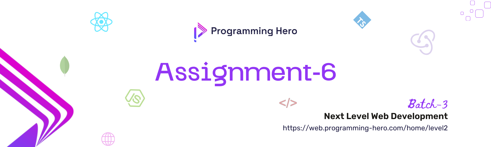



## **⚠️ Important: If you're finding the current assignment requirements too challenging or running into issues, you have the option to work on the [alternative assignment]([https://example.com](https://github.com/Apollo-Level2-Web-Dev/mern-last-game-batch-4-assignment-6)). Those who haven't started the current assignment yet can feel free to switch to this one. 🎯**

# Assignment 6: Full-Stack Application 🎯

Welcome to **Assignment 6**! 🎉 This is your final challenge in the series, focusing on refining your full-stack web application. In this assignment, you will optimize the performance, enhance security, and apply advanced techniques to ensure your project is production-ready.

---

## 🛠️ Technology You Can Use

- **Frontend Development**: 
  - Next.js 
  - Redux 
  - TypeScript

- **Backend Development**:
  - Node.js
  - Express
  - Mongoose 

- **Database**:
  - MongoDB 
  

- **Deployment**:
  - Vercel, Netlify 

---

## 🔗 Objective

The goal of this assignment is to build a fully functional web application by integrating a frontend with the backend system. This involves:

- Connecting your frontend to the backend APIs.
- Implementing user and admin dashboards with real-time data.
- Ensuring smooth interaction and data flow between the frontend and backend systems.
- Applying UI/UX principles to create a user-friendly interface.

### 🔗 Key Tasks

- Frontend Integration: Connect the frontend with the backend endpoints to enable data retrieval, submission, and interaction.
- Dashboard Implementation: Develop user and admin dashboards that display relevant data and analytics.
- UI/UX Design: Design a clean, intuitive, and responsive user interface to enhance the user experience.
- Error Handling: Implement proper error handling to manage and display errors gracefully.

---

## ⚙️ Guidelines

- **Code Consistency**: Maintain a consistent code style throughout the project. Use ESLint and Prettier to enforce best practices.
- **Database Optimization**: Ensure your database queries are efficient. Use indexing and optimize any slow queries.
- **Security**: Implement proper authentication and data validation. Protect your API routes using security middleware.
- **Documentation**: Update your README file with detailed instructions for setting up, using, and deploying the app. Include details about optimizations, testing, and improvements made in this assignment.
- **Version Control**: Commit regularly, with meaningful messages that reflect the changes made.

---

### 🚀 Common Instructions for Assignment 6:

1. **Roles and Permissions**:
   - Implement **two roles**: User and Admin.
   - A **User** should be able to perform both visitor (e.g., browsing, viewing content) and author activities (e.g., creating and managing posts or content).
   - An **Admin** should have extended permissions such as managing users, reviewing content, and other administrative operations.

2. **Authentication System**:
   - Implement a **custom authentication system**.
   - Skip using external authentication services like **NextAuth** or **Firebase** to reduce complexity.
   - Ensure the authentication system supports login, registration, and token expiration(jwt token), while allowing role-based access control.

3. **Password Validation**:
   - Make sure there’s no password validation requiring special characters or uppercase/lowercase letters.

4. **Error-Free Deployment**:
   - Before submission, ensure the application works **without "Page Not Found" errors** when deployed on **Vercel** or **Netlify**.
   - Test all routes, links, and deployment configurations to ensure the frontend functions correctly with the backend.

5. **Credentials Submission**:
   - Include the **necessary admin and user credentials** for evaluation in your submission.
   - Ensure the credentials work during the demo and allow access to the respective features based on user roles.

6. **Frontend-Backend Integration**:
   - Properly connect the **frontend to backend endpoints** for seamless interaction and data exchange.
   - Test each feature to ensure data flows smoothly between client and server (e.g., user data retrieval, content creation, and role management).

By following these instructions, you'll ensure your project is built with the right focus on functionality, user experience, and smooth deployment.

---

## 🔢 Assignment Number Based on the Last Digit of PH Student ID

| Last Digit of PH Student ID | Assignment Number (Design No)                                                             |
| --------------------------- | ----------------------------------------------------------------------------------------- |
| 0, 1                        | [1 Travel Tips & Destination Guides](./#1%20Travel%20Tips%20&%20Destination%20Guides.md)  |
| 2, 3                        | [#2 Gardening Tips & Advice Platform](./#2%20Gardening%20Tips%20&%20Advice%20Platform.md) |
| 4, 5                        | [#3 Tech Tips & Tricks Hub](./#3%20Tech%20Tips%20&%20Tricks%20Hub.md)                     |
| 6, 7                        | [#4 Pet Care Tips & Stories](./#4%20Pet%20Care%20Tips%20&%20Stories.md)                   |
| 8, 9                        | [#5 Recipe Sharing Community](./#5%20Recipe%20Sharing%20Community.md)                     |

---

## 📤 Submission Guidelines

- **GitHub Repositories**: Submit the links to both frontend and backend repositories.
- **Live Deployment Links**: Provide live URLs for the client and server.
- **Project Overview Video**: Create a video walkthrough highlighting the features and optimizations.
- **Admin Credentials**: Include admin login credentials if required for the demo.

### ⏰ **Submission Deadline:**

- 60 Marks: October 03, 2024, 11.59 PM ⏳
- 50 Marks: October 08, 2024, 11.59 PM ⌛
- 30 Marks: October 09 - October 10, 11:59PM ⌛

### ⏰ **Considereble Deadline:**
- October 13, 2024, 11.59 PM ⏳

---

## 🚫 **Important Note:**

Plagiarism will not be tolerated. Your work must be original, and any instance of plagiarism will result in a score of **0 Marks**.

---

Good luck with Assignment 6! 🎯 Let’s take your project to the next level and make it production-ready! 🍀
